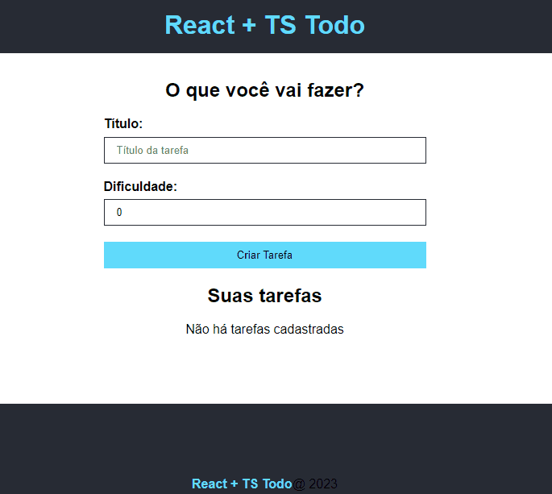

# Projeto React + TS ToDo

## Objetivo

- Construir gerenciador de tarefas utilizando o TypeScrip e o React. 

<br>

## Índice 📜

#### Screenshot

#### Requisitos do Projeto

#### O Projeto

#### Tecnologias Usadas

#### Como rodar o projeto

<br>

## Screenshot 🎬

<div align='center'>

</div>

<br>

## Requisitos funcionais do Projeto 🧾

- O site terá uma tela para cadastro de nova tarefa com as seguintes informações: o título da tarefa e o grau de dificuldade da tarefa;
- cada tarefa terá um botão de edição e exclusão da tarefa;
- ao clicar no botão de edição deverá abrir na mesma tela o formulário para edição;
- as novas tarefas serão exibidas uma em baixo das outras.

<br>

## O Projeto 📚

Este projeto faz parte do aprendizado em React com TypeScript. Por isso, mais do que uma aplicação Web este programa gerenciador de tarefas foi projetado para colocar em prática os conceitos da biblioteca React com TypeScript, como componentes, props, interfaces, generics entre outros. 

<br>

<br>

## Tecnologias Usadas 🛠

- React;
- TypeScript;
- JavaScript;
- Vite;
- CSS;
- Bootstrap.

<br>

## Como rodar o projeto 🎮

Clone o repositório
```bash
git clone https://github.com/ederhscc/todo_react
```

 Acesse a pasta do projeto
```bash
cd todo_react

```

Instalar as dependências
```bash
npm install
```

Execute a aplicação
```bash
npm run dev
```

<br>

## Autor 🧑

### Eder Henrique Santos

<br>

## Links 🔗

Deploy: https://

<div align="left">

  <a href = "mailto:ederhscc@gmail.com" target="_blank">
  
  </a>
  </br>
  <a href="https://www.linkedin.com/in/eder-henrique-santos" target="_blank">
  
  </a>
  </br>

</div>


